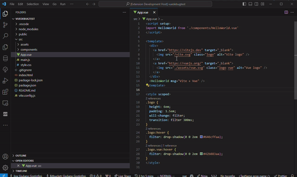
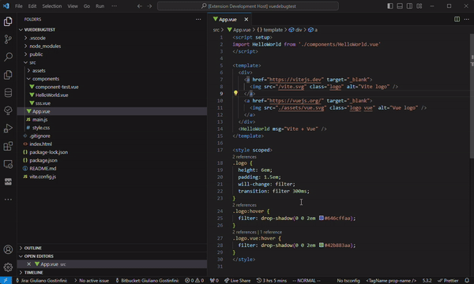

# Make JS component 
This is [Make Js Component](https://github.com/Giuliano1993/make-js-component) VS Code Extension.
This tool, just like its npx equivalent, removes the tedious component creation from your flow, adding the capability to create a brand new development-ready component right from your command Palette.
At the moment we support the following JS Frameworks:
- Vue
- React
- Angular
- Svelte
- Qwik
- Astro

## Commands

### Make Js Component
The basic command. It let you create a component, choosing the name and picking the framework

### Make Js Component - Detect Framework
Leave the framework choice to MJC, it will detect the framework you're using and will pick the correct component template for you.

> **Warning!**
> 
> This extension is still in early stages
> 
> If you encounter a bug, feel free to report it on the [issues on our repo](https://github.com/Giuliano1993/make-js-component-vscode/issues).
>
>Every contribution is welcome, be them issues, ideas or code contribution in order to improve this new-born extension 
> If you'd like to support the project you can leave a star on this repo or on the npx command one.
> 
> In any case, thank you for the interest!